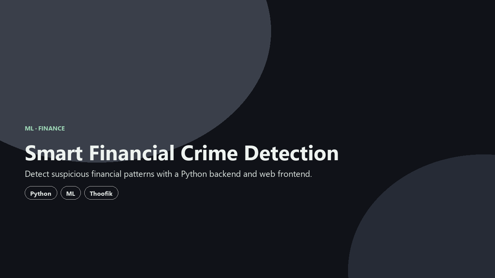

<div align="center">

# Smart Financial Crime Detection

**Fraud detection dashboard** — train a model, explore transactions, and score risk.

</div>

<div align="center">
  
</div>

---

## Why this exists

Financial crime signals hide in transaction streams. This full-stack app trains a Logistic Regression model on your data, shows analytics, and runs single or batch predictions.

---

## What you can do

- **Dashboard** — fraud vs normal counts, types, daily/weekly trends (ECharts)
- **Predict** — single-transaction fraud probability and risk level
- **Explorer** — dataset preview and train on uploaded CSV/Excel
- **By Person** — look up accounts and per-transaction scores

---

## Tech stack

| Layer | Technology |
| --- | --- |
| Backend | FastAPI · numpy · pandas · scikit-learn |
| Frontend | React 18 · Vite · React Router · ECharts |
| Model | Logistic Regression (see `ML_MODEL.md`) |

---

## Getting started

**Backend**

```bash
cd backend
pip install -r requirements.txt
python -m uvicorn app.main:app --reload --host 0.0.0.0 --port 8000
```

**Frontend**

```bash
cd frontend
npm install
npm run dev
```

See the repo for sample datasets and training notes.

---

## Live & credits

| | |
| :--- | :--- |
| **Author** | [Nishanth K R](https://github.com/Nishanth1409) |
| **Collaborators** | [Thoofik](https://github.com/thoofik) |
| **Repo** | [Nishanth1409/Smart-financial-crime-detection](https://github.com/Nishanth1409/Smart-financial-crime-detection) |
| **Portfolio** | [nkrportfolio.vercel.app](https://nkrportfolio.vercel.app) |

---

<div align="center">

*Son of a farmer · always a farmer.*

[GitHub](https://github.com/Nishanth1409) · [Portfolio](https://nkrportfolio.vercel.app)

</div>
