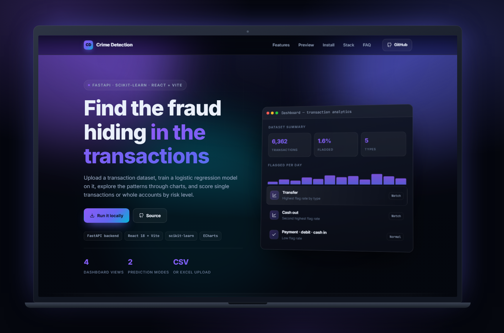
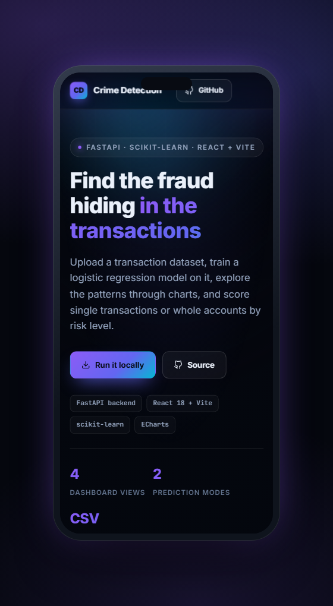
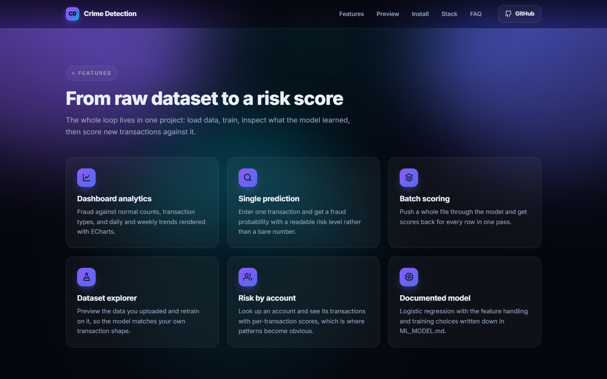
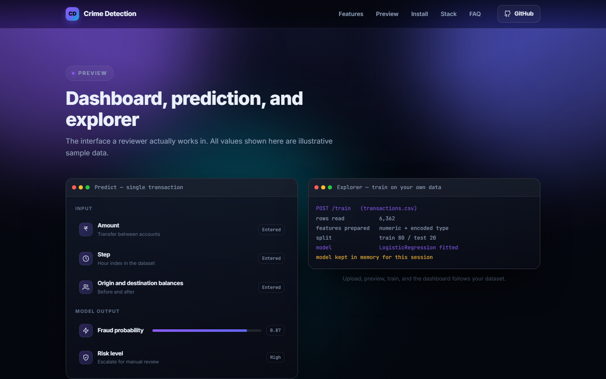
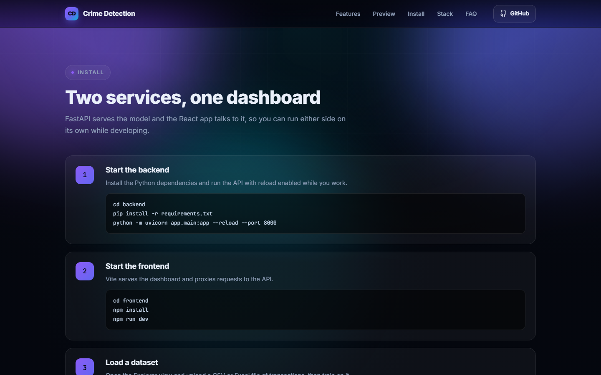

<div align="center">

# Smart Financial Crime Detection

**Fraud detection dashboard and scoring API** — Upload a transaction dataset, train a logistic regression model on it, explore the patterns through charts, and score single transactions or whole accounts by risk level.

   

[**Live site →**](https://nishanth1409.github.io/Smart-financial-crime-detection/)

</div>

<div align="center">
  
  <p><em>One page, three screens — television, laptop, and phone.</em></p>
</div>

---

## Why this exists

Financial crime hides in ordinary-looking transaction streams, and a spreadsheet will not surface it. This project closes the whole loop in one place: upload a dataset, train a logistic regression model on it, read what the model learned through the dashboard, then score single transactions or a whole account. Logistic regression is a deliberate choice — its coefficients can be explained, which matters more here than winning a fraction of a percent of accuracy.

> Built by **Nishanth K R** — *son of a farmer, always a farmer.*

---

## What you can do

- **Dashboard analytics** — Fraud against normal counts, transaction types, and daily and weekly trends rendered with ECharts.
- **Single prediction** — Enter one transaction and get a fraud probability with a readable risk level rather than a bare number.
- **Batch scoring** — Push a whole file through the model and get scores back for every row in one pass.
- **Dataset explorer** — Preview the data you uploaded and retrain on it, so the model matches your own transaction shape.
- **Risk by account** — Look up an account and see its transactions with per-transaction scores, which is where patterns become obvious.
- **Documented model** — Logistic regression with the feature handling and training choices written down in ML_MODEL.md.

---

## See it on every screen

| Laptop · 1440 × 900 | Phone · 390 × 844 |
| :---: | :---: |
|  |  |

---

## Every feature, one by one

### From raw dataset to a risk score

The whole loop lives in one project: load data, train, inspect what the model learned, then score new transactions against it.



### Dashboard, prediction, and explorer

The interface a reviewer actually works in. All values shown here are illustrative sample data.



### Two services, one dashboard

FastAPI serves the model and the React app talks to it, so you can run either side on its own while developing.



---

## Tech stack

| Layer | Technology |
| --- | --- |
| Backend | FastAPI · numpy · pandas · scikit-learn |
| Frontend | React 18 · Vite · React Router · ECharts |
| Model | Logistic regression, documented in ML_MODEL.md |
| Data input | CSV or Excel upload, trained per session |

---

## Getting started

### 1. Start the backend

Install the Python dependencies and run the API with reload enabled while you work.

```bash
cd backend
pip install -r requirements.txt
python -m uvicorn app.main:app --reload --port 8000
```

### 2. Start the frontend

Vite serves the dashboard and proxies requests to the API.

```bash
cd frontend
npm install
npm run dev
```

### 3. Load a dataset

Open the Explorer view and upload a CSV or Excel file of transactions, then train on it.

### 4. Score transactions

Use Predict for a single transaction, or By Person to review every transaction on one account.

---

## Good to know

<details>
<summary><strong>Is this production fraud detection?</strong></summary>

No. It is a working end-to-end project for learning and demonstration. Real deployments need drift monitoring, human review workflows, and far more validation.

</details>

<details>
<summary><strong>Why logistic regression instead of a boosted model?</strong></summary>

It trains in seconds, the coefficients can be explained, and explainability matters more than a marginal accuracy gain in a teaching project.

</details>

<details>
<summary><strong>Does it keep my uploaded data?</strong></summary>

The model is trained per session from the file you upload. Nothing is published anywhere by the project itself.

</details>

<details>
<summary><strong>Can I use my own dataset?</strong></summary>

Yes — that is what Explorer is for. Column names need to match what the training step expects.

</details>

---

## Live & credits

| | |
| :--- | :--- |
| **Live** | [nishanth1409.github.io/Smart-financial-crime-detection](https://nishanth1409.github.io/Smart-financial-crime-detection/) |
| **Author** | [Nishanth K R](https://github.com/Nishanth1409) |
| **Collaborators** | [Thoofik](https://github.com/thoofik) |
| **Repo** | [Nishanth1409/Smart-financial-crime-detection](https://github.com/Nishanth1409/Smart-financial-crime-detection) |
| **Portfolio** | [nkrportfolio.vercel.app](https://nkrportfolio.vercel.app) |

---

<div align="center">

*Son of a farmer · always a farmer.*

[GitHub](https://github.com/Nishanth1409) · [Portfolio](https://nkrportfolio.vercel.app)

</div>
